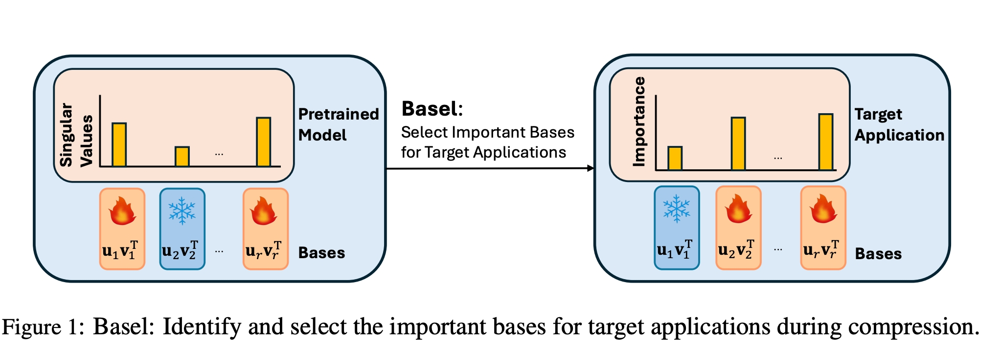
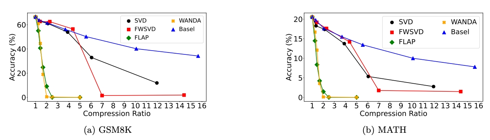
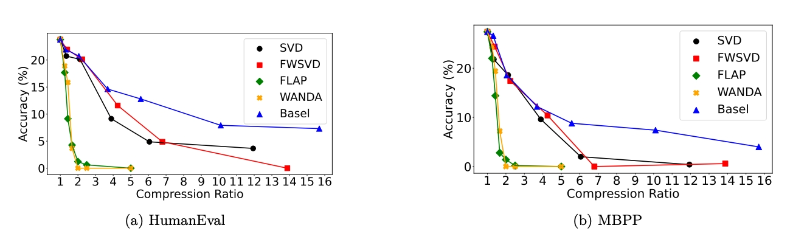

<p align="center">
<table>
  <tr>
    <td align="center" width="50%">
      <!-- <br><br> -->
      <b>Dr. Yang Li</b><br>
      <i>Department of Computer Science, Iowa State University</i><br>
      <a href="https://jerryyangli.github.io/">Website</a>
    </td>
    <td align="center" width="50%">
      <!-- <br><br> -->
      <b>Daniel Agyei Asante</b><br>
      <i>Department of Computer Science, 
        Iowa State University</i><br>
      <a href="https://carozy797.github.io/">Website</a>
    </td>
  </tr>
</table>
</p>

## 📖 Streamlining Language Models via Semantic Basis Analysis
### 📃 <a href="https://arxiv.org/pdf/2405.15877" target="_blank">Paper</a>

**Basel** is a principled low-rank compression framework designed to operate directly on the semantic structure of large language model weight matrices. It identifies the bases that encode high-impact semantic features for the target task and removes those with negligible contribution. This reduces weight parameters and memory footprint and improves inference throughput while preserving task accuracy. Basel achieves up to 2.7× model size reduction compared to state-of-the-art techniques and enables efficient deployment of language models on edge devices and in cost-sensitive environments.
Basel is validated across mathematical reasoning (GSM8K, MATH), code generation (HumanEval, MBPP), and on language modeling (WikiText-2).
Basel plays well with other compression methods and often beats them at their own game.

🔸 Basel with 8-bit achieves better accuracy than 4-bit quantization

🔸 Basel outperforms many existing low-rank and pruning-based compression methods

🔸 Models compressed with Basel remain stable under deeper compression levels where pruning accuracy collapses.




## 🔍 Table of Contents
- [🖥️ Software Dependencies](#software_dep)
- [🧩 Basel Part 1](#part1)
- [🚀 Basel Part 2](#part2)
- [💪 What Basel Delivers](#results)
- [📝 Citation](#citation)


<a id="software_dep"></a>
## 🖥️  Software Dependencies

### 1) Get the repo
```
git clone https://github.com/Iowa-State-University-AI-System-Group/Basel.git
cd Basel
```
### 2) Create & activate a virtual environment
### 3) Install PyTorch
```
pip install --index-url https://download.pytorch.org/whl/cu124 \
  torch==2.4.0+cu124 torchvision==0.19.0+cu124 torchaudio==2.4.0+cu124
```
### 4) Install the project requirements
```
pip install -r requirements.txt
```

<a id="part1"></a>
## 🧩 Basel Part 1: Compression

Part 1 takes a dense model as input and generates a low-rank factorized model together with a dimension file specifying the shapes of its weight matrices.

<!--  -->
**Compression code**   [`train_bs_part1.py`](./train_bs_math_p1.py)

**ModelArguments**
- `--model_name_or_path` — name or path of pretrained model to compress
- `--output_directory` — directory to save factorized model and `dim.json`
- `--use_fast_tokenizer` — whether to use fast tokenizer

**DataArguments**
- `--data_path` — dataset file or directory for fine-tuning

**TrainingArguments**
- `--model_max_length` — maximum sequence length
- `--cache_dir` — where cached models are stored
- `--optim` — optimizer (e.g., adamw_torch)
- `--bs_keeping_epoch` — warm-up epochs before basis selection begins
- `--basis_selection_threshold` — kept rank based on SVD contribution
- `--bs_additional_dim` — extra low-rank dimension added during selection
- `--bs_shrinking_step` — number of pruning iterations
- `--bf16` / `--fp16` — optional mixed precision flags
- `--overwrite_output_dir` — overwrite outputs if they exist
- `--output_dir` — directory for training logs and checkpoints

**▶️ Part 1 Example Usage**

```
tochrun train_bs_part1.py \
    --model_name_or_path <model_path> \
    --data_path <data_path> \
    --data_length <data_length> \
    --output_directory <output_directory> \
    --use_fast_tokenizer <true_or_false> \
    --num_train_epochs <epochs> \
    --per_device_train_batch_size <batch_size> \
    --per_device_eval_batch_size <batch_size> \
    --gradient_accumulation_steps <grad_accum> \
    --evaluation_strategy "no" \
    --save_strategy "steps" \
    --save_steps <save_steps> \
    --save_total_limit <max_checkpoints> \
    --learning_rate <learning_rate> \
    --weight_decay 0.0 \
    --warmup_ratio 0.03 \
    --lr_scheduler_type "cosine" \
    --logging_steps 500 \
    --gradient_checkpointing True \
    --bf16 <true_or_false> \
    --tf32 <true_or_false> \
    --fp16 <true_or_false> \
    --basis_selection_threshold <svd_threshold> \
    --bs_additional_dim <additional_low_rank_dim> \
    --bs_keeping_epoch <warmup_epochs> \
    --bs_shrinking_step <pruning_steps> \
    --report_to "none" 
```
<a id="part2"></a>
## 🚀  Basel Part 2: Finetuning + Decompression

Part 2 takes the factorized model and dimension file as input, fine-tunes the factorized model, and decompresses it into an equivalent dense model. The decompressed dense model is generated solely to facilitate convenient performance evaluation of the fine-tuned low-rank model.

**Fine-tuning + decompression code**   [`train_bs_part2.py`](./train_bs_math_p2.py)

**ModelArguments**
- `--model_name_or_path` — pretrained model to load (same base as Part 1)
- `--part_1_output_path` — directory containing Part 1 outputs (factorized weights + `dim.json`)
- `--decompressed_model_path` — directory where the merged/decompressed checkpoint will be saved
- `--use_fast_tokenizer` — enable fast tokenizer (True/False)

**DataArguments**
- `--data_path` — path to training dataset
- `--data_length` — number of samples to use for training

**▶️ Part 2 Example Usage**
```
torchrun train_bs_math_p2.py \
  --model_name_or_path <model_path> \
  --data_path <data_path> \
  --data_length <data_length> \
  --part_1_output_path <part1_output_dir> \
  --decompressed_model_path <decompressed_ckpt_dir> \
  --use_fast_tokenizer <true_or_false> \
  --num_train_epochs <epochs> \
  --per_device_train_batch_size <batch_size> \
  --per_device_eval_batch_size <batch_size> \
  --gradient_accumulation_steps <grad_accum> \
  --evaluation_strategy "no" \
  --save_strategy "steps" \
  --save_steps <save_steps> \
  --save_total_limit <max_checkpoints> \
  --learning_rate <learning_rate> \
  --weight_decay 0.0 \
  --warmup_ratio 0.03 \
  --lr_scheduler_type "cosine" \
  --logging_steps 500 \
  --fsdp "full_shard auto_wrap" \
  --fsdp_transformer_layer_cls_to_wrap 'LlamaDecoderLayer' \
  --gradient_checkpointing True \
  --bf16 <true_or_false> \
  --tf32 <true_or_false> \
  --fp16 <true_or_false> \
  --report_to "none"
 ```
<a id="results"></a>
## 💪 What Basel Delivers
### 1. Mathematical Reasoning Task

### 2. Programming Task

### 3. Language Modeling Task


<a id="citation"></a>
## 📝 Citation
```
@article{basel,
      title={{Streamlining Language Models via Semantic Basis Analysis}}, 
      author={Li, Yang and Asante, Daniel Agyei and Zhao, Changsheng and Chang, Ernie and Shi, Yangyang and Chandra, Vikas},
      journal={Transactions on Machine Learning Research}, 
      year={2025},
}
```
</p>
 
